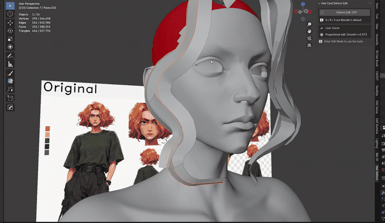

# Hair Card Deform Edit

Blender 4.2 add-on for editing hair cards that are bent by a Curve (or Lattice,
Armature, Simple Deform) modifier.

Toggle off, then on. Same cards, same keys.

## The problem

Put a Curve modifier on a hair card and edit it. The card on screen is bent, but
the vertices you grab still live in the flat, undeformed cage. Drag a vertex
right and it goes somewhere else. The further the card bends, the worse it gets.

## What this does

Turn the toggle on and G / R / S work in the space you actually see. Drag a
vertex to the right, it goes right. The add-on inverts the modifier stack every
frame so the result lands where you put it.

Works with proportional editing, snapping, multi-object edit mode, and
Shrink/Fatten.

### Alt+S on a tapered card

Blender's Shrink/Fatten offsets the cage vertex along its normal, and the Curve
modifier then rescales that offset by the control point radius. On a card whose
curve tapers, the same drag produces between 0.51x and 1.0x of the thickness you
asked for - thin spots where the taper is tightest. Here the offset is applied
to the visible position along the visible normal, so 1.0x lands everywhere.

### Smooth Card

Cards pushed around vertex by vertex end up with corners along their edges and
faces of very different sizes. Vertex > Smooth Card (Ctrl+V), or the button in
the sidebar panel, smooths the card in the shape you see:

- Corners along the edges are taken out; the overall bend of the card is kept.
- Card width is kept. Blender's Smooth Vertices collapses a bent card toward a
  line and moves the root and tip.
- The root, the tip and anything not selected never move.
- Smooth (0-1) sets how much small detail is removed.
- Spacing: Keep leaves the rows where they are along the card; Even also gives
  every face the same length.

On a bent test card with jagged edges, the sharpest corner went from 26 to 8
degrees and the width error from 20% to 7%.

## Install

Edit > Preferences > Add-ons > Install from Disk, pick the zip, enable it.

Blender 4.2 only.

## Use

Sidebar (N) > Hair Deform tab > big ON/OFF toggle.

While it is on:

- `G` / `R` / `S` - move, rotate, scale in deformed space
- `Alt+S` - shrink/fatten along the visible normal
- `Shift+Alt+G` / `R` / `S` - same thing, always available even with the toggle off
- `Shift+Alt+F` - shrink/fatten, always available
- `X` / `Y` / `Z` - axis constraint, `Shift+X` etc for plane
- `Ctrl` - toggle snapping mid-drag
- Wheel / PageUp / PageDown - proportional falloff size
- `Shift` - precision
- `Esc` / right click - cancel

On a plain mesh with no deform modifier the keys behave like stock Blender, so
you can leave the toggle on.

The add-on switches on "Display in Edit Mode" for the modifier when it needs to.
A freshly added Curve modifier has it off, which is why nothing would happen
otherwise.

## Notes

- Pivot point setting is respected, including 3D cursor.
- Proportional falloff is fixed when the drag starts, same as Blender. The
  falloff distance is measured on the bent card you see, so a curved card
  bends smoothly instead of kinking at the selection.
- Multi-object edit mode is supported: every mesh in the session gets its own
  solve, and the selection moves as one rigid group like Blender's transform.
- Snap targets are read off deformed geometry, so you snap onto what you see.
  Snapping is a screen-space search with a pixel radius, matching Blender - it
  takes the feature nearest the cursor rather than the nearest in 3D.
- Snapping sets position, not rotation. Align Rotation to Target is ignored.
- Undo during a heavy edit session can be unstable. Save before undoing.
- If the curve folds over on itself the inverse has no unique answer. The header
  warns instead of writing garbage.

## Speed

Measured on a 4.2 build, single-threaded:

| selection | rate |
|---|---|
| one card, 66 verts | ~1000 fps |
| 10 cards, 165 verts selected | ~260 fps |
| 50 cards, 1650 verts selected | ~45 fps |
| 100 cards, 6600 verts selected | ~14 fps |

Accuracy stays under 0.01% across Curve, Lattice, Armature, Simple Deform, and
chains of those, with or without Subsurf and Mirror.

## License

GPL-2.0-or-later.
